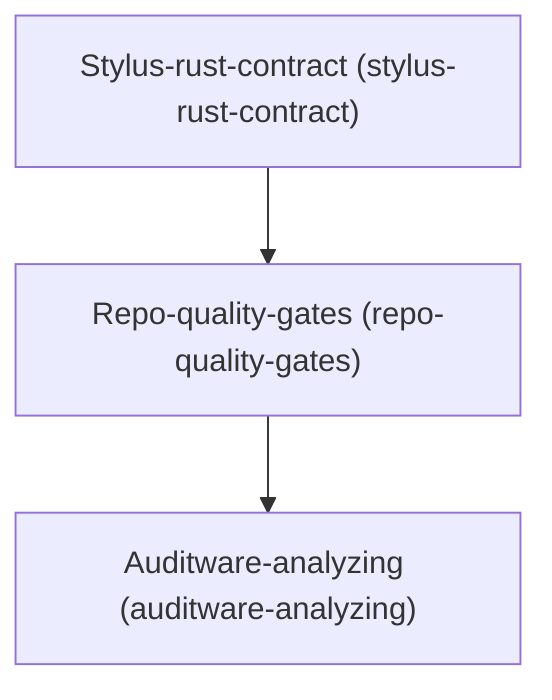

# Architecture

## Dependency Graph

```mermaid
graph TD
  f15e8607["Stylus-rust-contract (stylus-rust-contract)"]
  3633f08d["Repo-quality-gates (repo-quality-gates)"]
  270ee821["Auditware-analyzing (auditware-analyzing)"]
  f15e8607 --> 3633f08d
  3633f08d --> 270ee821
```

## Execution / Implementation Order

1. **Stylus-rust-contract** (`f15e8607`)
2. **Repo-quality-gates** (`3633f08d`)
3. **Auditware-analyzing** (`270ee821`)
