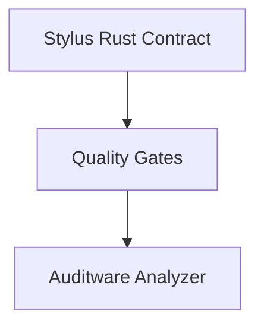

# My Dapp

> A Web3 application - composed with [N]skills

**Network**: Arbitrum Sepolia (Chain ID: 421614) — Testnet
**Keywords**: web3, dapp

---

## Architecture

## Components

| Component | Type | Category | User Prompt |
|-----------|------|----------|-------------|
| Stylus Rust Contract | `stylus-rust-contract` | contracts | (none) |
| Quality Gates | `repo-quality-gates` | quality | (none) |
| Auditware Analyzer | `auditware-analyzing` | contracts | (none) |

## Implementation Order

Build the project in this order (respects dependencies):

1. **Stylus Rust Contract** (`stylus-rust-contract`) — see `.cradle/components/stylus-rust-contract--f15e8607.md`
2. **Quality Gates** (`repo-quality-gates`) — see `.cradle/components/repo-quality-gates--3633f08d.md`
3. **Auditware Analyzer** (`auditware-analyzing`) — see `.cradle/components/auditware-analyzing--270ee821.md`

## Environment Variables

| Key | Description | Required | Default |
|-----|-------------|----------|---------|
| `STYLUS_RPC_URL` | Arbitrum RPC URL for deployment | Yes | https://sepolia-rollup.arbitrum.io/rpc |
| `DEPLOYER_PRIVATE_KEY` | Private key for deployment | Yes |  |

## Key Dependencies

| Package | Version |
|---------|---------|
| (none) | |

## Detailed Component Specs

- [Stylus Rust Contract](.cradle/components/stylus-rust-contract--f15e8607.md)
- [Quality Gates](.cradle/components/repo-quality-gates--3633f08d.md)
- [Auditware Analyzer](.cradle/components/auditware-analyzing--270ee821.md)

## Additional Context

- [Project Configuration](.cradle/project.md)
- [Full Architecture Details](.cradle/architecture.md)
- [All Environment Variables](.cradle/environment.md)
- [Verified Dependencies](.cradle/dependencies.md)
- [Scripts Reference](.cradle/scripts.md)
- [Integration Map](.cradle/integration-map.md)

---

*Generated by [[N]skills](https://www.nskills.xyz) — Compose N skills for your Web3 project.*
